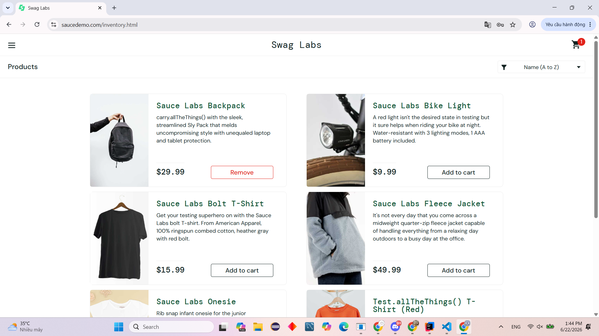
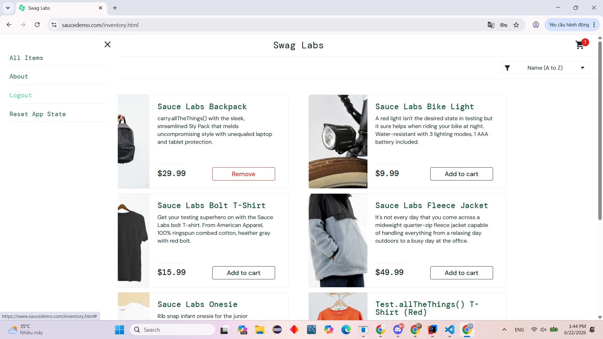
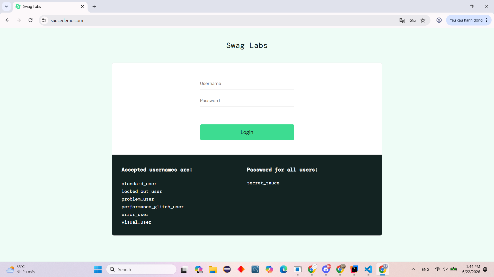
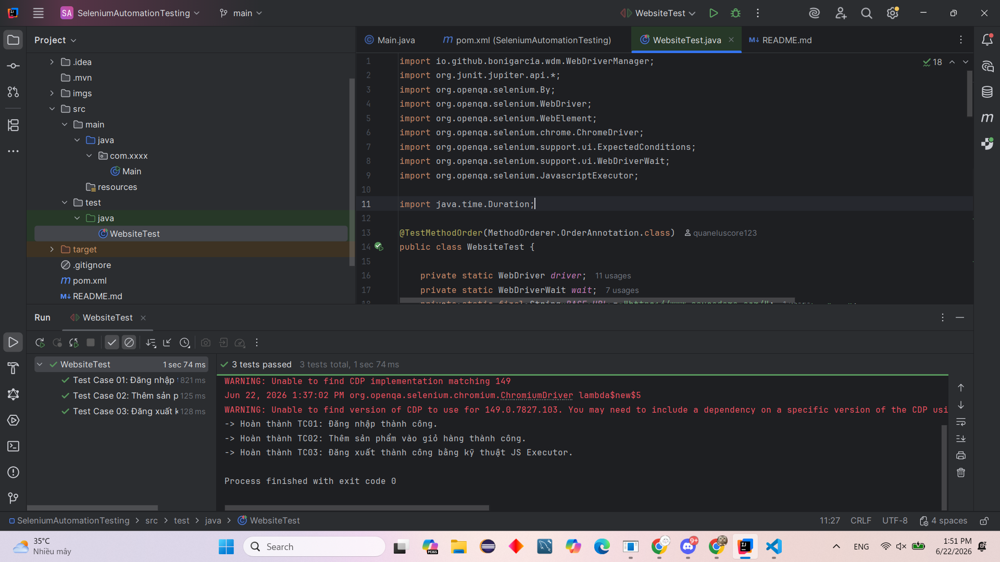

# Kiểm Thử Tự Động (Automation Testing) - SauceDemo

Dự án này thực hiện xây dựng và thực thi các kịch bản kiểm thử tự động cho website giả lập thương mại điện tử **[SauceDemo](https://www.saucedemo.com/)**. Mục tiêu của dự án là tự động hóa quá trình kiểm thử các tính năng cốt lõi của người dùng cuối (End-to-End Testing) để đảm bảo tính ổn định của hệ thống.

## 🛠 Công cụ & Công nghệ sử dụng
Dự án được xây dựng dựa trên hệ sinh thái Java với các công nghệ và thư viện hiện đại:
- **Ngôn ngữ lập trình:** Java (JDK 23)
- **Thư viện Automation:** Selenium WebDriver v4.18.1
- **Test Framework:** JUnit 5 (Jupiter)
- **Quản lý Driver:** WebDriverManager v5.7.0 (Tự động tải và cấu hình ChromeDriver)
- **Build Tool:** Apache Maven
- **Trình duyệt kiểm thử:** Google Chrome

## Danh sách Test Case (Kịch bản kiểm thử)
Dự án thực thi chuỗi 03 kịch bản kiểm thử nối tiếp nhau, bao quát luồng hành vi cơ bản của người dùng:

### Test Case 01: Đăng nhập hệ thống (Login)
- **Mô tả:** Kiểm thử chức năng đăng nhập sử dụng tài khoản hợp lệ được cung cấp sẵn (`standard_user` / `secret_sauce`).
- **Kết quả mong đợi:** Hệ thống xác thực thành công và chuyển hướng người dùng đến trang danh sách sản phẩm (`/inventory.html`).


### Test Case 02: Thêm sản phẩm vào giỏ hàng (Add to Cart)
- **Mô tả:** Tương tác với giao diện sản phẩm (Sauce Labs Backpack) và thực hiện hành động thêm vào giỏ.
- **Kết quả mong đợi:** Huy hiệu (badge) trên biểu tượng giỏ hàng xuất hiện và cập nhật số lượng thành "1".



### Test Case 03: Đăng xuất an toàn (Logout)
- **Mô tả:** Mở Side Menu và chọn tính năng Đăng xuất để kết thúc phiên làm việc.
- **Kỹ thuật áp dụng:** Sử dụng `JavascriptExecutor` để bypass hiệu ứng chuyển động (Overlay/Animation) của ReactJS trên Sidebar Menu, đảm bảo thao tác click diễn ra chính xác 100%.
- **Kết quả mong đợi:** Hệ thống hủy phiên đăng nhập và đưa người dùng trở lại trang chủ đăng nhập.





### Test thành công/Thất bại
- Khi test thành công/thất bại sẽ trả kết quả về terminal của Intelij khi chạy file test.



## Các Kỹ thuật Nâng cao Đã Áp Dụng
Để đảm bảo script chạy ổn định trên mọi môi trường và không bị lỗi Timeout/NoSuchElement, dự án đã áp dụng các kỹ thuật:
1. **Explicit Wait (WebDriverWait):** Sử dụng `ExpectedConditions` để đợi thông minh cho đến khi các phần tử thực sự sẵn sàng (Clickable/Visible/Present) thay vì dùng `Thread.sleep()` cứng nhắc.
2. **JavascriptExecutor:** Xử lý các phần tử bị che khuất bởi Animation của giao diện web hiện đại (DOM Overlays).
3. **Data-test Attributes:** Ưu tiên sử dụng bộ định vị `[data-test='...']` (được thiết kế riêng cho kiểm thử) thay vì XPath hay Class Name để tăng tính ổn định khi giao diện thay đổi.

## Hướng dẫn cài đặt và chạy dự án (Local Machine)
1. Đảm bảo máy tính của bạn đã cài đặt **Java (JDK 11+)** và **Maven**.
2. Clone repository này về máy:
   ```bash
   git clone [https://github.com/quaneluscore123/kiem-thu-tu-dong-selenium](https://github.com/quaneluscore123/kiem-thu-tu-dong-selenium)